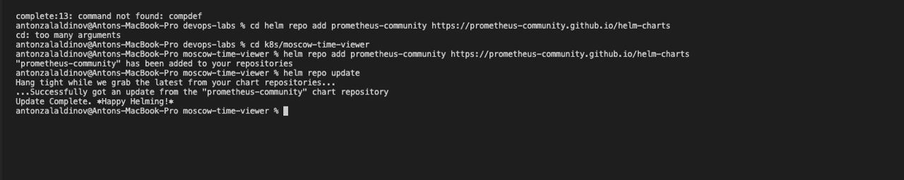
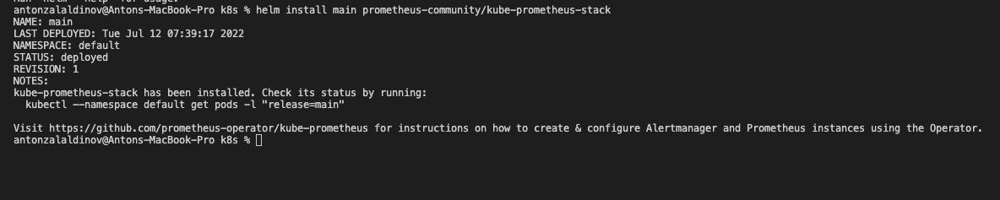
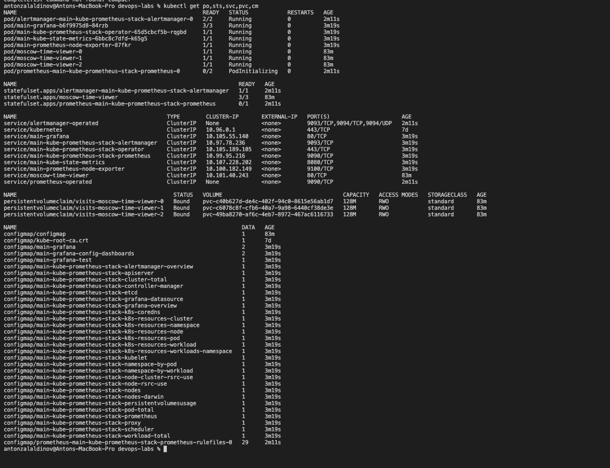
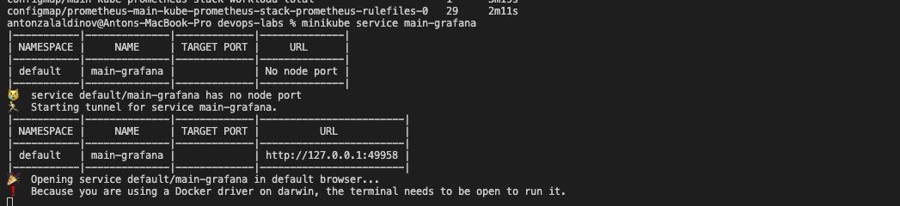
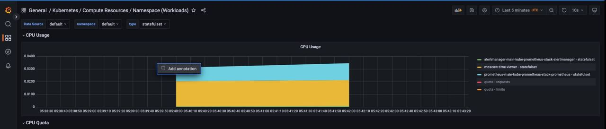
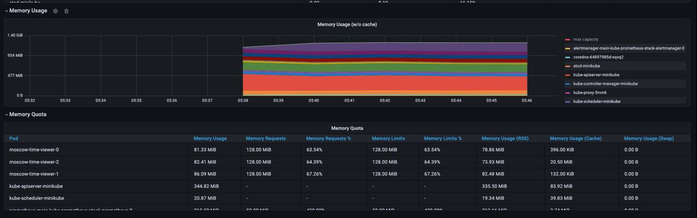
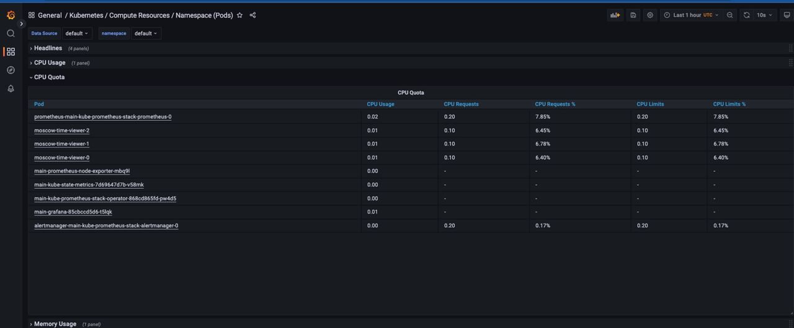
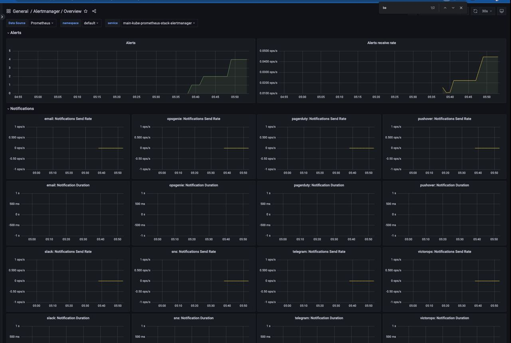

# Kube Prometheus Stack

Prometheus - Main brick of the stack. Monitoring system which collects metrics, which are available on prometheus web

Grafana - web app for analytics and visualization

Alertmanager - tool for analyzing notifications, it removes duplicates, group them and send notifications

Node-exporter - collects metrics about computing resources Node in Kubernetus

Kube-state-metrics - collects metrics from all Kubernetus nodes.

