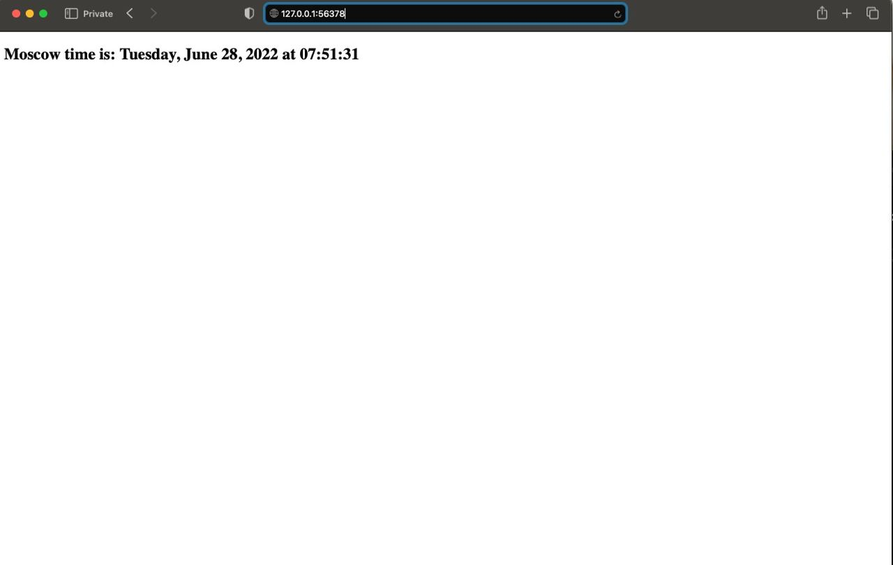

```
antonzalaldinov@Antons-MacBook-Pro devops-labs % kubectl get pods,svc
NAME                                                 READY   STATUS    RESTARTS   AGE
pod/moscow-time-viewer-deployment-86c49f6cfc-tr5bw   1/1     Running   0          2m16s

NAME                         TYPE           CLUSTER-IP      EXTERNAL-IP   PORT(S)          AGE
service/kubernetes           ClusterIP      10.96.0.1       <none>        443/TCP          12m
service/moscow-time-viewer   LoadBalancer   10.111.240.30   <pending>     5000:32717/TCP   21s
```

```

antonzalaldinov@Antons-MacBook-Pro devops-labs % minikube service --all
|-----------|------------|-------------|--------------|
| NAMESPACE |    NAME    | TARGET PORT |     URL      |
|-----------|------------|-------------|--------------|
| default   | kubernetes |             | No node port |
|-----------|------------|-------------|--------------|
😿  service default/kubernetes has no node port
|-----------|--------------------|-------------|---------------------------|
| NAMESPACE |        NAME        | TARGET PORT |            URL            |
|-----------|--------------------|-------------|---------------------------|
| default   | moscow-time-viewer |        5000 | http://192.168.49.2:32717 |
|-----------|--------------------|-------------|---------------------------|
🏃  Starting tunnel for service kubernetes.
🏃  Starting tunnel for service moscow-time-viewer.
|-----------|--------------------|-------------|------------------------|
| NAMESPACE |        NAME        | TARGET PORT |          URL           |
|-----------|--------------------|-------------|------------------------|
| default   | kubernetes         |             | http://127.0.0.1:56021 |
| default   | moscow-time-viewer |             | http://127.0.0.1:56025 |
|-----------|--------------------|-------------|------------------------|
🎉  Opening service default/kubernetes in default browser...
🎉  Opening service default/moscow-time-viewer in default browser...
❗  Because you are using a Docker driver on darwin, the terminal needs to be open to run it.
```


